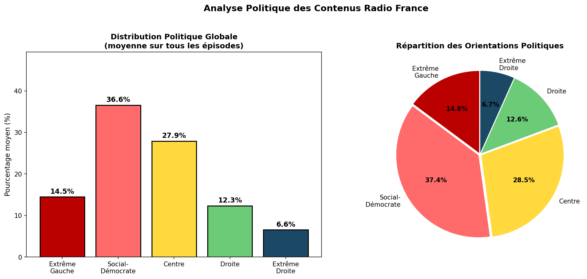
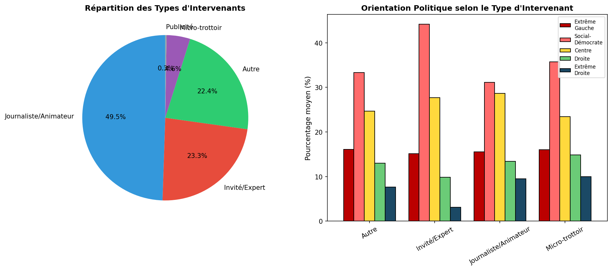
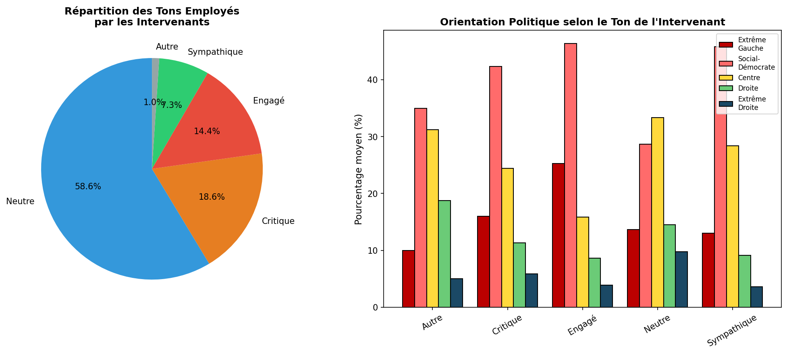
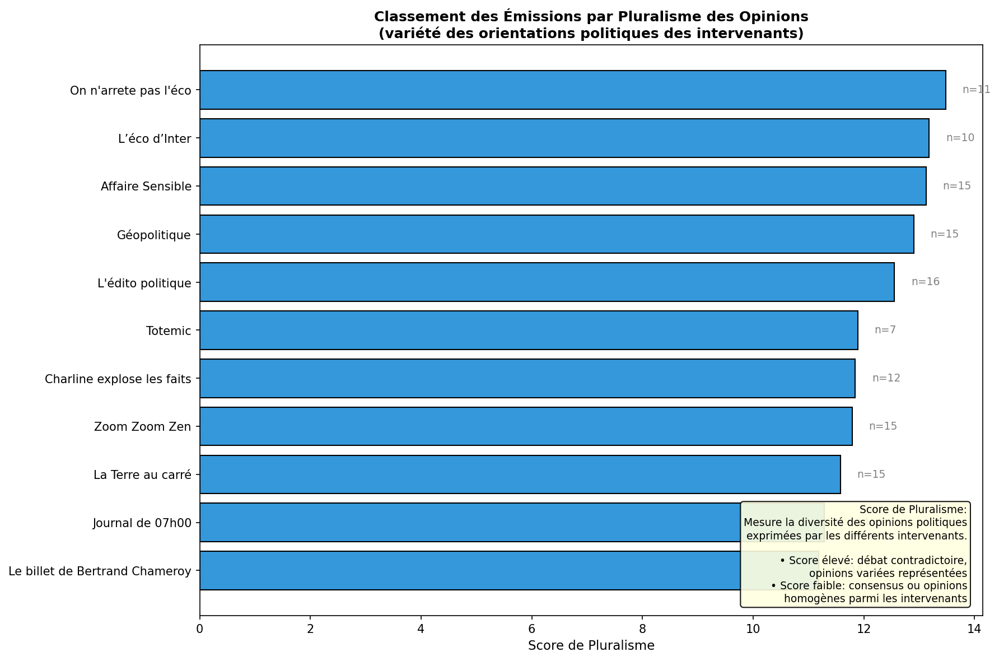
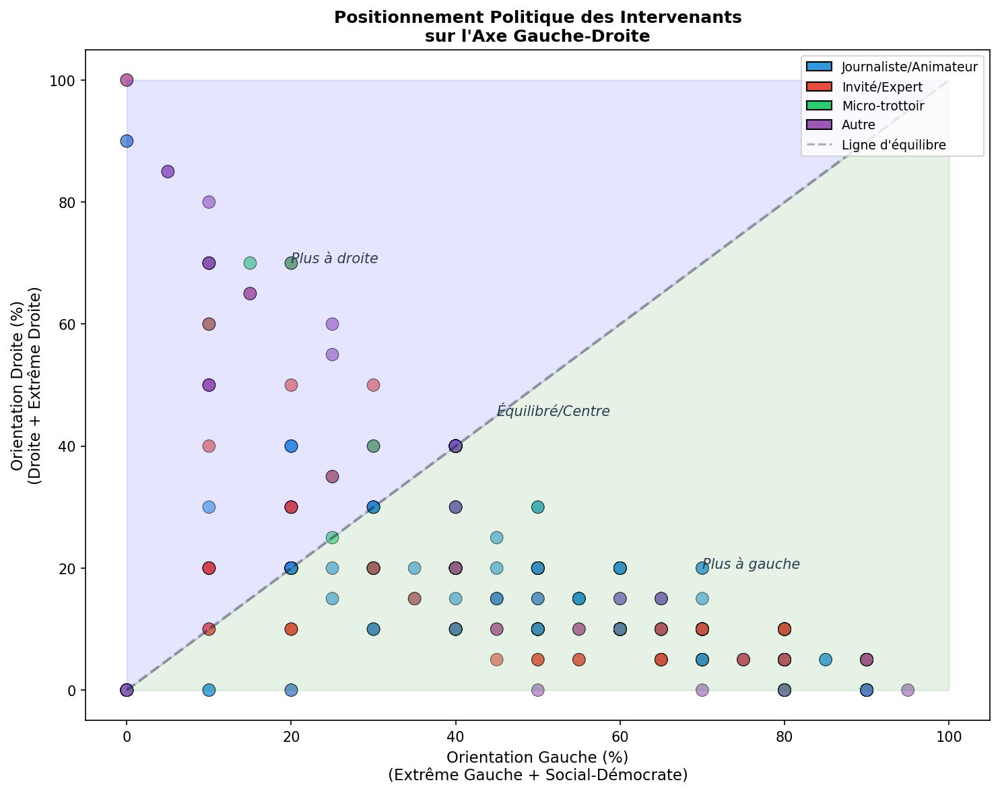
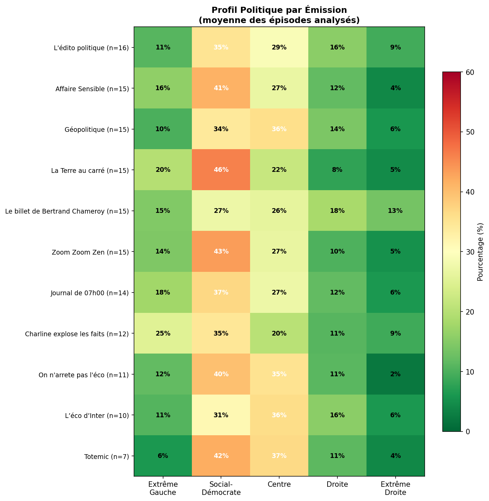

# 📻 Analyse du Biais Politique de France Inter

> Étude computationnelle de l'orientation politique et du biais éditorial des programmes de France Inter

[](https://www.python.org/)
[](LICENSE)
[](#-accès-aux-données)

## 📋 Table des matières

- [Aperçu](#-aperçu)
- [Résultats clés](#-résultats-clés)
- [Méthodologie](#-méthodologie)
- [Installation](#-installation)
- [Calibration du modèle](#-calibration-du-modèle)
- [Utilisation](#-utilisation)
- [Structure du projet](#-structure-du-projet)
- [Limites](#-limites)
- [Pistes d'amélioration](#-pistes-damélioration)
- [Accès aux données](#-accès-aux-données)
- [Licence](#-licence)

## 🎯 Aperçu

Ce projet analyse automatiquement l'orientation politique des émissions de France Inter en utilisant :

1. **Transcription automatique** via l'API Gladia (ASR + diarisation des locuteurs)
2. **Analyse politique** via GPT-4.1-mini pour classifier le contenu selon le spectre politique français

### Corpus analysé

| Métrique                  | Valeur |
| ------------------------- | ------ |
| Épisodes analysés         | 145    |
| Émissions différentes     | 11     |
| Locuteurs identifiés      | 764    |
| Moyenne locuteurs/épisode | 5,3    |
| Taux de réussite          | 100%   |

## 📊 Résultats clés

### Orientation politique moyenne

| Orientation          | Pourcentage |
| -------------------- | :---------: |
| Extrême gauche       |    14,7%    |
| **Social-démocrate** |  **37,4%**  |
| Centre               |    28,7%    |
| Droite               |    12,7%    |
| Extrême droite       |    6,6%     |

**Total Gauche** (Extrême gauche + Social-démocrate) : **52,1%**  
**Total Droite** (Droite + Extrême droite) : **19,3%**

### Biais éditorial détecté

- 🟢 **Léger** : 95,2% des épisodes (n=138)
- 🟡 **Marqué** : 3,4% des épisodes (n=5)
- ⚪ **Neutre** : 1,4% des épisodes (n=2)

### Orientation dominante par épisode


```
Social-démocrate  ████████████████████████████████████  69,7% (101)
Centre            ███████████                           21,4% (31)
Extrême gauche    ████                                   7,6% (11)
Droite            ▏                                      0,7% (1)
Extrême droite    ▏                                      0,7% (1)
```

### Distribution politique globale



### Orientation par émission


### Rôles des intervenants



### Tons employés



### Pluralisme des opinions



### Spectre politique des intervenants



### Heatmap par émission



### Émissions analysées

| Émission                       | Épisodes | Type                     |
| ------------------------------ | :------: | ------------------------ |
| L'édito politique              |    16    | Commentaire politique    |
| Géopolitique                   |    15    | Affaires internationales |
| Zoom Zoom Zen                  |    15    | Bien-être                |
| Le billet de Bertrand Chameroy |    15    | Satire                   |
| La Terre au carré              |    15    | Environnement/Science    |
| Affaire Sensible               |    15    | Documentaire             |
| Journal de 07h00               |    14    | Information              |
| Charline explose les faits     |    12    | Humour                   |
| On n'arrête pas l'éco          |    11    | Économie                 |
| L'éco d'Inter                  |    10    | Économie                 |
| Totemic                        |    7     | Culture                  |

## 🔬 Méthodologie

### Pipeline de traitement

```
┌─────────────────┐     ┌─────────────────┐     ┌─────────────────┐
│   Audio MP3     │────▶│   Gladia API    │────▶│  Transcription  │
│  (France Inter) │     │  (ASR + Diar.)  │     │  + Locuteurs    │
└─────────────────┘     └─────────────────┘     └────────┬────────┘
                                                         │
                                                         ▼
┌─────────────────┐     ┌─────────────────┐     ┌─────────────────┐
│   Résultats     │◀────│   GPT-4.1-mini  │◀────│    Analyse      │
│   JSON/CSV      │     │   (Temp: 0.3)   │     │   Politique     │
└─────────────────┘     └─────────────────┘     └─────────────────┘
```

### Catégories politiques

Le modèle classe le contenu selon 5 catégories du spectre politique français :

| Catégorie            | Partis associés    | Caractéristiques                                      |
| -------------------- | ------------------ | ----------------------------------------------------- |
| **Extrême gauche**   | LFI, NPA           | Anticapitalisme, lutte des classes, anti-impérialisme |
| **Social-démocrate** | PS, EELV           | Réformisme, justice sociale, écologie, féminisme      |
| **Centre**           | Renaissance, MoDem | Pragmatisme, libéralisme modéré, européisme           |
| **Droite**           | LR                 | Conservatisme, libéralisme économique, autorité       |
| **Extrême droite**   | RN, Reconquête     | Nationalisme, anti-immigration, souverainisme         |

### Analyse par locuteur

Pour chaque locuteur identifié, le système évalue :

- **Rôle probable** : journaliste/animateur, invité expert, micro-trottoir, autre
- **Scores politiques** : répartition en % sur les 5 catégories (total = 100%)
- **Ton** : neutre, critique, engagé, sympathique, hostile
- **Justification** : explication textuelle de l'orientation

## 💻 Installation

### Prérequis

- Python 3.11+
- Clés API : [Gladia](https://gladia.io) et [OpenAI](https://platform.openai.com)

### Installation des dépendances

```bash
pip install pandas requests tqdm matplotlib
```

### Configuration

Créez un fichier `.env` ou modifiez directement les variables dans le notebook :

```python
gladia_key = 'votre_clé_gladia'
openai_key = 'votre_clé_openai'
```

## 🧪 Calibration du modèle

Avant d'utiliser l'algorithme sur un large corpus, il est recommandé de **tester et calibrer** le modèle sur des contenus dont l'orientation politique est connue.

### Script de calibration

Le fichier `calibration.ipynb` permet de tester l'algorithme sur un fichier audio unique :

```python
# Exemple d'utilisation
TEST_MP3_URL = "https://drive.google.com/uc?export=download&id=VOTRE_ID"
```

### Fichiers de test suggérés

Pour valider la calibration, nous recommandons de tester avec des discours de personnalités politiques connues :

| Personnalité       | Orientation attendue |
| ------------------ | -------------------- |
| Jean-Luc Mélenchon | Extrême gauche       |
| Olivier Faure      | Social-démocrate     |
| Emmanuel Macron    | Centre               |
| Éric Ciotti        | Droite               |
| Marine Le Pen      | Extrême droite       |

### Comment calibrer

1. **Téléchargez** un extrait audio d'un discours politique (2-5 min)
2. **Uploadez** sur Google Drive et récupérez le lien de partage
3. **Convertissez** le lien :

```
   # Lien de partage :
   https://drive.google.com/file/d/XXXXX/view?usp=sharing

   # Lien de téléchargement direct :
   https://drive.google.com/uc?export=download&id=XXXXX
```

4. **Exécutez** `calibration.ipynb` avec cette URL
5. **Comparez** le résultat avec l'orientation attendue

### Interpréter les résultats de calibration

```
✅ Bonne calibration : Le score le plus élevé correspond à l'orientation attendue
⚠️ Calibration acceptable : L'orientation attendue est dans le top 2
❌ Mauvaise calibration : Revoir le prompt ou changer de modèle
```

## 🚀 Utilisation

### 1. Préparer les données

Créez un fichier CSV `franceinter.csv` avec les colonnes :

```csv
mp3link,emission,title,date,description,isProcessed
https://...,L'édito politique,Titre de l'épisode,2024-01-15,Description...,False
```

### 2. Lancer la transcription

```python
# Exécuter les cellules de transcription du notebook
# Les transcriptions sont sauvegardées dans transcription_results.json
```

### 3. Lancer l'analyse politique

```python
# Exécuter les cellules d'analyse politique
# Les résultats sont sauvegardés dans political_analysis.json
```

### 4. Générer les visualisations

```python
# Exécuter les cellules de visualisation
# Génère les graphiques dans le dossier images/
```

## 📁 Structure du projet

```
radiofrance-analysis/
├── 📓 radiofrance.ipynb           # Notebook principal (transcription + analyse)
├── 📓 calibration.ipynb           # Notebook de test/calibration du modèle
│
├── 📄 franceinter.csv             # Données d'entrée (URLs des épisodes)
├── 📄 transcription_results.json  # Transcriptions avec diarisation
├── 📄 political_analysis.json     # Résultats de l'analyse politique
├── 📄 political_summary.csv       # Résumé exportable
│
└── 📁 images/
    ├── 🖼️ dominant_orientation.png
    ├── 🖼️ viz_01_distribution_globale.png
    ├── 🖼️ viz_02_biais_editorial.png
    ├── 🖼️ viz_03_orientation_par_emission.png
    ├── 🖼️ viz_04_roles_intervenants.png
    ├── 🖼️ viz_05_tons.png
    ├── 🖼️ viz_06_pluralisme.png
    ├── 🖼️ viz_07_spectre_politique.png
    └── 🖼️ viz_08_heatmap_emissions.png
```

## ⚠️ Limites

### Limites méthodologiques

- **Erreurs de calcul du LLM** : Les pourcentages de répartition politique n'atteignent pas toujours exactement 100%. Un système de normalisation a été implémenté pour corriger ces écarts, mais cela introduit une légère approximation dans les scores finaux.

- **Subjectivité du prompt** : Le prompt d'analyse peut être discutable et influence fortement les résultats. Le choix des termes, des exemples et de la structure du prompt constitue un biais inhérent à la méthode.

- **Granularité temporelle** : Analyse par épisode complet plutôt que par minute, sans pondération par temps de parole. Un intervenant parlant 30 secondes a le même poids qu'un intervenant parlant 30 minutes dans le calcul final.

- **Modèle unique** : Utilisation d'un seul LLM (GPT-4.1-mini) avec ses biais propres. Les modèles de langage reflètent les biais de leurs données d'entraînement et peuvent avoir des sensibilités différentes selon les sujets.

- **Qualité de transcription** : Qualité variable avec des scores de confiance parfois bas (0,2-0,5). Les erreurs de transcription peuvent impacter l'analyse politique, notamment sur les termes techniques ou les noms propres.

- **Taille de l'échantillon** : L'analyse porte sur un échantillon spécifique de 145 épisodes qui nécessite une documentation complète pour permettre la reproductibilité et l'évaluation de la représentativité.

- **Catégorisation simplifiée** : 5 catégories pour représenter un spectre politique complexe. Cette simplification peut masquer des nuances importantes et des positions hybrides.

- **Absence de pondération contextuelle** : Le système ne distingue pas entre les propos rapportés (citations) et les opinions exprimées directement par les intervenants.

### Limites techniques

- **Biais du modèle** : Reflète les biais d'entraînement de GPT-4.1-mini, notamment sur les sujets contemporains ou controversés.

- **Diarisation imparfaite** : Erreurs possibles lors d'échanges rapides, de chevauchements de voix ou de changements de locuteurs fréquents.

- **Neutralité = 20% partout** : Un locuteur neutre est codé avec 20% sur chaque catégorie, ce qui peut ne pas refléter un vrai contenu apolitique ou strictement factuel. Cette stratégie tend à sur représenter ceux qui sont sous représentés et vice versa.

- **Pas de vérification humaine systématique** : Absence de validation par des annotateurs humains pour établir un ground truth et mesurer la précision réelle du système.

## 🔧 Pistes d'amélioration

### Améliorations méthodologiques prioritaires

- **Validation croisée multi-modèles** : Utiliser 3-4 LLMs différents (Claude, Gemini, Llama) et agréger les résultats pour plus de robustesse. Permet de réduire les biais spécifiques à un modèle unique.

- **Pondération temporelle** : Analyser minute par minute et pondérer selon le temps de parole effectif de chaque intervenant. Donnerait un poids proportionnel à l'exposition médiatique réelle.

- **Système de validation automatique** : Vérifier automatiquement que les pourcentages totalisent exactement 100% et corriger les écarts par normalisation proportionnelle systématique.

- **Validation humaine avec ground truth** : Comparer avec des annotations humaines sur un échantillon témoin (50-100 épisodes) pour établir des métriques de précision (accuracy, F1-score) et identifier les cas d'erreur systématique.

- **Revue par des experts en sciences politiques** : Faire valider le prompt, les catégories et la méthodologie par des chercheurs en sciences politiques pour garantir la pertinence académique.

### Améliorations techniques

- **Documentation précise de l'échantillonnage** : Documenter en détail la méthode de sélection des épisodes, les critères d'inclusion/exclusion, et les biais potentiels de l'échantillon.

- **Distinction citation/opinion** : Implémenter un système pour différencier les propos rapportés des opinions directement exprimées par les locuteurs.

- **Analyse de l'incertitude** : Ajouter des intervalles de confiance sur chaque score politique pour quantifier l'incertitude du modèle.

- **Tracking longitudinal** : Analyser l'évolution temporelle des orientations pour détecter d'éventuels changements de ligne éditoriale.

- **Analyse comparative inter-médias** : Étendre la méthode à d'autres stations (France Culture, France Info, RTL, Europe 1) pour permettre des comparaisons.

### Améliorations de l'analyse

- **Analyse de sentiment fine** : Intégrer une analyse de sentiment (positif/négatif/neutre) en complément de l'orientation politique.

- **Détection des figures rhétoriques** : Identifier l'usage d'ironie, de sarcasme ou de second degré qui peut fausser l'analyse littérale.

- **Analyse des sujets traités** : Corréler les orientations politiques détectées avec les thématiques abordées (économie, environnement, société, international).

- **Mesure du pluralisme affiné** : Développer des métriques plus sophistiquées du pluralisme (indice de Herfindahl-Hirschman, entropie de Shannon) au-delà de l'écart-type simple.

## 📈 Visualisations générées

Le projet génère automatiquement 8 visualisations :

| Fichier                               | Description                                         |
| ------------------------------------- | --------------------------------------------------- |
| `viz_01_distribution_globale.png`     | Distribution politique moyenne (barres + camembert) |
| `viz_02_biais_editorial.png`          | Répartition du biais éditorial                      |
| `viz_03_orientation_par_emission.png` | Orientation par émission (barres empilées)          |
| `viz_04_roles_intervenants.png`       | Analyse des rôles des speakers                      |
| `viz_05_tons.png`                     | Distribution des tons employés                      |
| `viz_06_pluralisme.png`               | Score de pluralisme par émission                    |
| `viz_07_spectre_politique.png`        | Positionnement gauche-droite des intervenants       |
| `viz_08_heatmap_emissions.png`        | Heatmap du profil politique par émission            |

## 📬 Accès aux données

Les données brutes (transcriptions et analyses) sont disponibles sur demande pour les chercheurs et journalistes.

**Contact** : 📧 [bg@benjamin-gabay.com](mailto:bg@benjamin-gabay.com)

Merci de préciser :

- Votre nom et affiliation
- L'objectif de votre demande
- L'utilisation prévue des données

## 🤝 Contribution

Les contributions sont les bienvenues ! N'hésitez pas à :

1. Fork le projet
2. Créer une branche (`git checkout -b feature/amelioration`)
3. Commit vos changements (`git commit -m 'Ajout d'une fonctionnalité'`)
4. Push sur la branche (`git push origin feature/amelioration`)
5. Ouvrir une Pull Request

## 📄 Licence

Ce projet est sous licence MIT. Voir le fichier [LICENSE](LICENSE) pour plus de détails.

## 📚 Citation

Si vous utilisez ce travail dans vos recherches, merci de citer :

```bibtex
@software{radiofrance_analysis,
  title = {Analyse du Biais Politique de France Inter},
  author = {Gabay, Benjamin and Anonymous Dolphin},
  year = {2025},
  url = {https://github.com/go-east/radio-france-analyse-biais-politique}
}
```

---

<p align="center">
  <b>⚠️ Avertissement</b><br>
  <i>Cette étude est un projet de recherche exploratoire réalisé en 24 heures dans le cadre d'un hackathon personnel. Les résultats doivent être interprétés avec prudence compte tenu des limites méthodologiques identifiées. Ce projet n'a pas vocation à porter un jugement définitif sur la ligne éditoriale de France Inter.</i>
</p>

---

<p align="center">
  Made with ❤️ for media transparency
</p>
